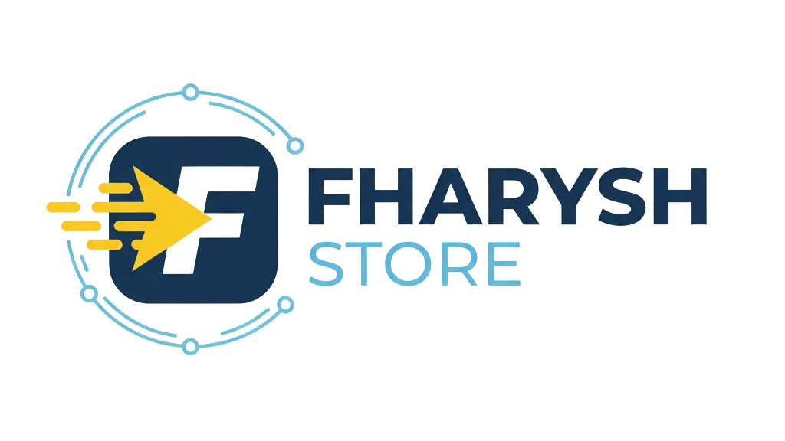

# FHARYSH STORE - Website Katalog Akun Premium

Website katalog resmi untuk FHARYSH STORE. Menyediakan akses mudah dan terjangkau ke berbagai akun layanan digital premium favorit Anda, mulai dari hiburan, kreativitas, edukasi, hingga utilitas.

**🔗 Website Live:** [https://fharysh.github.io/Fharysh-Store/](https://fharysh.github.io/Fharysh-Store/)

---

## ✨ Fitur Unggulan

* **Katalog Produk Lengkap:** Lebih dari 50+ pilihan akun premium terorganisir per kategori.
* **Navigasi Dropdown Interaktif:** Menu "Katalog" yang mudah digunakan (_on-click_) dengan sub-kategori produk yang dapat diperluas (_nested_).
* **Desain Responsif:** Tampilan optimal di berbagai perangkat (Desktop, Tablet, Mobile).
* **UI/UX Modern:**
    * Animasi ketik (Typed.js) di _Hero Section_.
    * Animasi elemen muncul saat _scroll_ (AOS, _looping_).
    * Efek _hover_ yang halus pada tombol dan kartu.
    * Tombol _Back-to-Top_ untuk navigasi cepat.
    * _Preloader_ halaman saat pertama dibuka.
* **Mode Gelap Otomatis:** Tampilan website menyesuaikan dengan pengaturan tema (_light/dark mode_) perangkat pengguna.
* **Performa:** _Lazy loading_ gambar untuk mempercepat waktu muat.
* **Pemesanan Mudah:** Tombol "Order via WA" langsung terhubung ke WhatsApp.

---

## 🛠️ Teknologi yang Digunakan

* HTML5
* CSS3 (Flexbox, Grid, Responsiveness, Dark Mode Support)
* JavaScript (ES6+)
* [AOS (Animate On Scroll)](https://michalsnik.github.io/aos/) - Animasi scroll
* [Typed.js](https://mattboldt.com/demos/typed-js/) - Efek ketik
* [GitHub Pages](https://pages.github.com/) - Hosting

---

## 🚀 Cara Menggunakan

Kunjungi link website live di atas untuk melihat katalog produk lengkap. Klik tombol "Order via WA" pada produk yang Anda inginkan untuk langsung terhubung dengan admin via WhatsApp.

---

## 📄 Lisensi

Proyek ini dilisensikan di bawah [MIT License](LICENSE).

---

_Dibuat dengan ❤️ oleh Muhammad Iqbal Alfarizi (FHARYSH STORE)_
